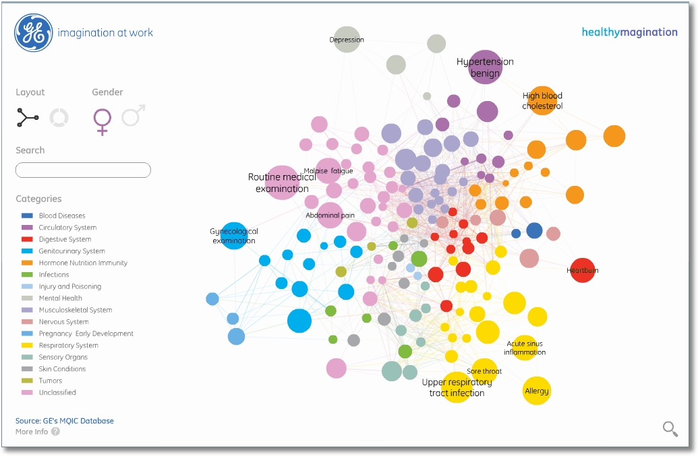

<h2>Tidy data</h2>

Based on: http://r4ds.had.co.nz/tidy-data.html

Based on: https://mchiapello.github.io/spreadsheet-ecology-lesson/

 
 
 

This seminar is a basic introduction to tidy data

---

<h2>Data analysis</h2>

+++

Note:
Focus on import as **data entering**
Focus on tidy in this session
Stress the reproducibility

---

<h2>Data storage</h2>

+++

<h2>Raw data</h2>
- The raw data are your original files
- Data you receive from facilities
- Data you collect from an experiment

These data should be store in a safe place and **never** touched!

Note:
Every time you need these data you copy them over

+++

<h2>Clean data</h2>

- There are your rawdata after the munging process 
- These are the data you can play with

---

<h2>Tidy data</h2>

+++

["Tidy Data paper"](http://www.jstatsoft.org/v59/i10/paper) published in the Journal of Statistical Software

There are three interrelated rules which make a dataset tidy:

1. Each **variable** must have its own column <!-- .element: class="fragment" -->
1. Each **observation** must have its own row <!-- .element: class="fragment" -->
1. Each **value** must have its own cell <!-- .element: class="fragment" -->

+++

+++

There are main advantages in tidy data:

1. **Consistency**
1. **Semplicity**
1. **Sharing**
1. **Data munging**
1. **Time saving**

---

<h2>Spreadsheet programs</h2>

+++

Spreadsheets are good for **data entry**
<h3>BUT</h3>
we use them for much more than data entry, like:

- data tables for publication
- summary statistics
- make figures

+++

<h5>In this seminar, we’re going to talk about:</h5>

- Good data entry practices - formatting data tables in spreadsheets
- How to avoid common formatting mistakes
- Basic quality control and data manipulation in spreadsheets
- Exporting data from spreadsheets

+++

<h5>In this seminar, we’re NOT going to talk about:</h5>
- How to do statistics in a spreadsheet
- How to do plotting in a spreadsheet
- How to write code in spreadsheet programs

- Data analysis in spreadsheets usually requires a lot of manual work
- It is also difficult to track or reproduce statistical or plotting analyses done in spreadsheet programs

+++

<h5>Reproducibility</h5>

**Reproducibility** is the keyword in science!

Spreadsheet are not reproducible! 

Unless you **keep track** of all the changes you made

---

<h2>Spreadsheet ERRORS</h2>

+++

<h2>Using multiple tables</h2>

---

<h2>Conclusion</h2>

1. NEVER touch the raw data<!-- .element: class="fragment" --> 
1. ALWAYS follow the tidy principles<!-- .element: class="fragment" -->
1. ALWAYS record file metadata<!-- .element: class="fragment" -->
1. ALWAYS record file process<!-- .element: class="fragment" -->
